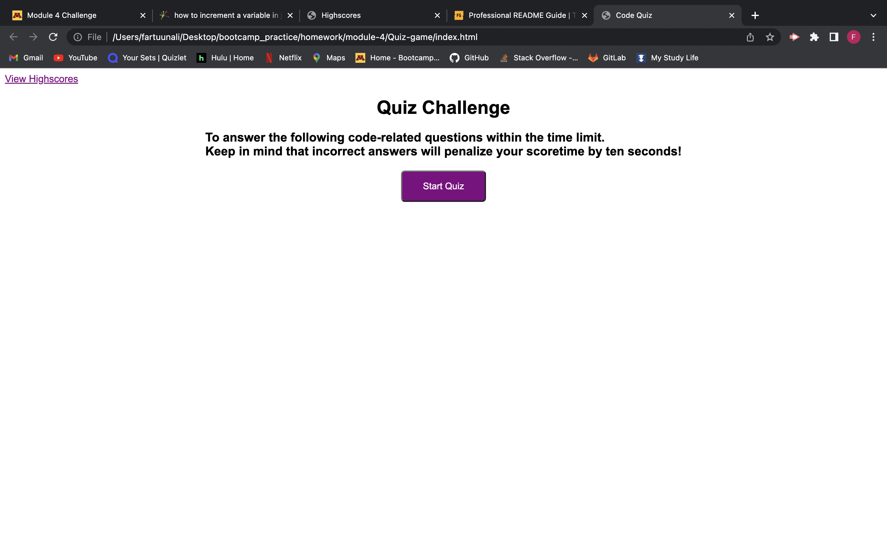

# Quiz Game

## Description

Provide a short description explaining the what, why, and how of your project. Use the following questions as a guide:
This is a short quiz game that asks you small little facts about the President. Once you answer you are able to  view the highscores which directs you to another page displaying the highscores. 

## Table of Contents 

If your README is long, add a table of contents to make it easy for users to find what they need.

- [Installation](#installation)
- [Usage](#usage)
- [Credits](#credits)

## Installation 
All you have to do is go to the creators github or get the deployed link to take you to the quiz game website where you will be presented with a quick description of how the game works.

## Usage

All you have to do is press the "Start Quiz" button where you will be directed to the first question.

   

## Credits
The link to the deployed link is down below, you can also find the github repo on [Fartuun Ali's page](https://github.com/afartuun/Quiz-game).
### [Deployed Link](https://afartuun.github.io/Quiz-game/)
